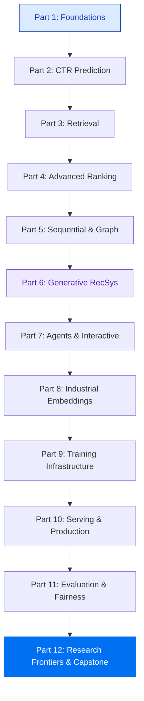

# Getting Started

Get up and running with the RecSys Tutorials in under 5 minutes.

---

## Prerequisites

- **Python 3.10 - 3.12**
- **[uv](https://docs.astral.sh/uv/getting-started/installation/)** — fast Python package manager

No GPU required. All exercises run on CPU with synthetic data.

## Installation

=== "Local (Recommended)"

    ```bash
    git clone git@github.com:hideak1/rec_system.git
    cd rec_system
    make install    # Install all dependencies
    make serve      # Start docs + Jupyter servers
    ```

    This starts two servers:

    | Server | URL | Purpose |
    |--------|-----|---------|
    | MkDocs | [localhost:8000](http://localhost:8000) | Browse tutorials |
    | Jupyter | [localhost:8888](http://localhost:8888) | Run exercises |

=== "Google Colab"

    Every notebook has an **"Open in Colab"** badge at the top. Click it to get a free copy — no local setup needed.

    [Open first notebook in Colab :material-open-in-new:](https://colab.research.google.com/github/hideak1/rec_system/blob/main/notebooks/part1/chapter_1.1_recommendation_problem.ipynb){ .md-button .md-button--primary }

## Commands

```bash
make install          # Install dependencies via uv
make serve            # Start both MkDocs + Jupyter servers
make docs             # Start only MkDocs docs server
make jupyter          # Start only Jupyter server
make build            # Build static site for deployment
make deploy           # Deploy to GitHub Pages
make clean            # Remove build artifacts
make sync-notebooks   # Copy notebooks into docs/ for MkDocs
```

## Learning Path

We recommend following the parts in order. Each part builds on concepts from previous ones.



**Fast track for experienced engineers:** Skip to Part 3 (Retrieval) or Part 6 (Generative) if you already know CF and CTR basics.

## Who Is This For?

!!! tip "ML Engineers Getting Started"
    Have ML/DL foundations and want to systematically learn recommendation systems. Want hands-on implementations of key algorithms (FM, DeepFM, DIN, SASRec, etc.).

!!! tip "Experienced RecSys Engineers"
    Already work on rec systems and want to understand cutting-edge architectures. Want to learn how Meta, Tencent, ByteDance build production systems at scale.

## Notebook Conventions

Throughout the tutorials, you'll see these callout blocks:

!!! info "Concept"
    Core concepts and theory explanations.

!!! warning "Common Pitfall"
    Mistakes that are easy to make and hard to debug.

!!! tip "Pro Tip"
    Expert-level insights from production systems.

!!! example "Exercise"
    Hands-on exercises with `TODO` blocks for you to implement.

## Next Steps

Ready? Start with **[Part 1: Foundations](../part1_foundations/)** to build your base, or jump to any part that interests you.
